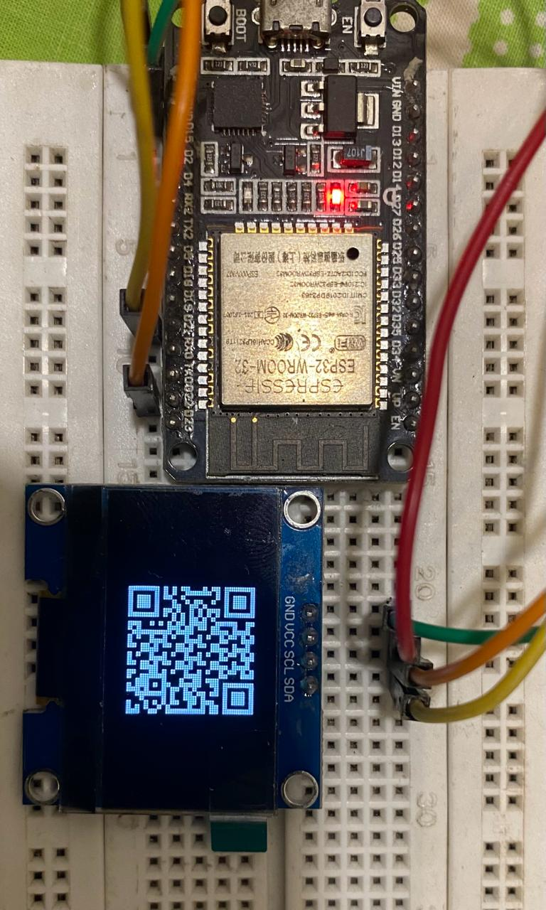

# ESP32 HomeKit integration

This repository provides a template for integrating ESP32 devices with HomeKit using Homebridge, without the need for Home Assistant. This is a QR enabled simple process of setting up ESP32 devices to work seamlessly within the Apple Home ecosystem, allowing users to control their ESP32 devices using Siri voice commands or the Apple Home app on iOS devices.

# Examples

There are some other images in the respective folder.

# Features
- **Easy Integration**: Simplifies the process of integrating ESP32 devices with HomeKit.
- **No Home Assistant Required**: Works directly with Homebridge, eliminating the need for additional middleware.
- **Seamless Pairing**: Includes a **QR code** for quick and effortless pairing with HomeKit.
- **Customizable**: Easily customize and extend functionality to suit your specific requirements.

# Contributing
This project is licensed under the [MIT License](https://opensource.org/licenses/MIT).

# Acknowledgements
I just put things together with some tinkering here and there, all thanks go to [**Homespan**](https://github.com/HomeSpan/HomeSpan) for setting up a very robust and user-friendly library. 

---

Note: This project is a simple template that I will be using in my later projects. If you wish to use this you may require specific customization to work with your specific ESP32 devices and configurations.

Refer to [**Homespan**](https://github.com/HomeSpan/HomeSpan) for detailed documentation. If you have any questions or encounter difficulties, don't hesitate to create an issue on this repository. I'll do my best to help.
